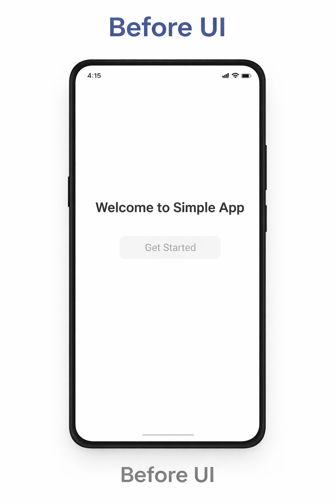
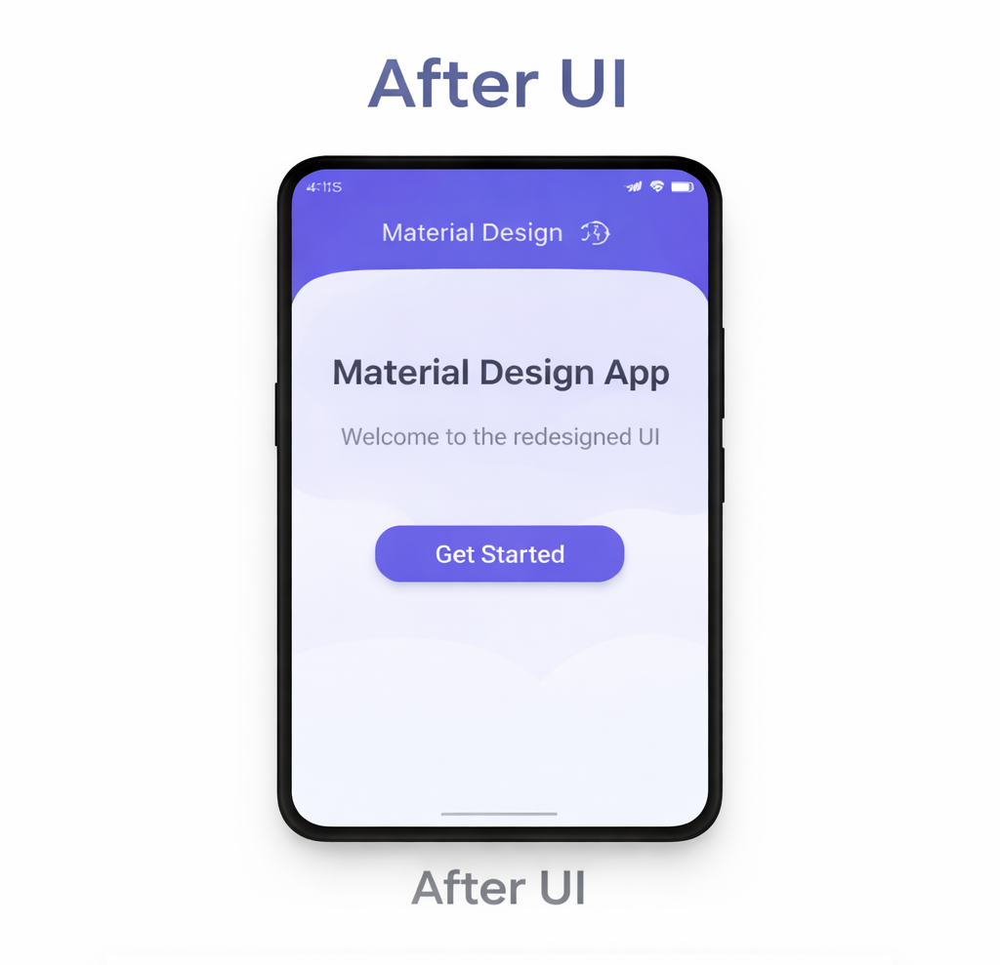
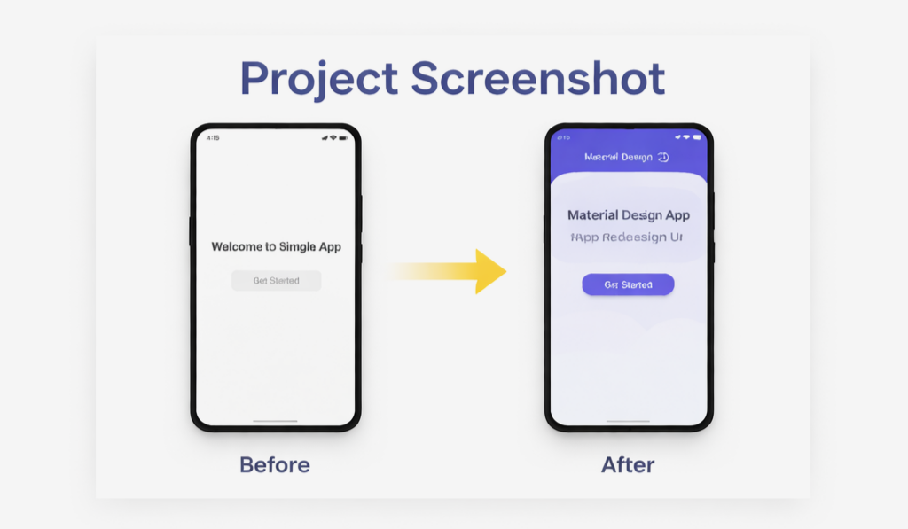

# UI/UX & Material Design – App Redesign

## 📱 Project Overview
This project demonstrates the redesign of a simple Android
application interface using Material Design principles.
The goal is to improve the overall user experience, visual design,
and accessibility by applying modern UI components and better layout structure.

## 🎯 Objective
Redesign an existing simple app screen and implement a cleaner 
and more modern interface following Material Design guidelines.

## ✨ Features
- Modern Material Design UI
- Improved color contrast
- Better spacing and layout
- User-friendly interface
- Accessible touch targets

## 🛠 Technologies Used
- Kotlin
- Android Studio
- XML Layouts
- Material Design Components
## 📸 App Screenshots

### Before UI


### After UI


### Project Screenshot



## 📂 Project Structure

```
MainActivity.kt
activity_main.xml
colors.xml
themes.xml
README.md
screenshot.png
```

## 🚀 How to Run
1. Clone the repository.
2. Open the project in Android Studio.
3. Build and run the application on an emulator or Android device.

## 📌 Conclusion
This project shows how UI/UX improvements and Material Design guidelines 
can enhance the usability and visual appeal of a simple Android application.
